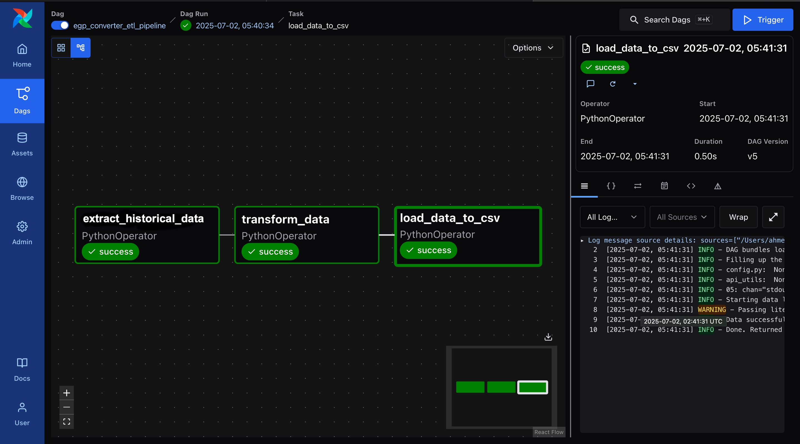
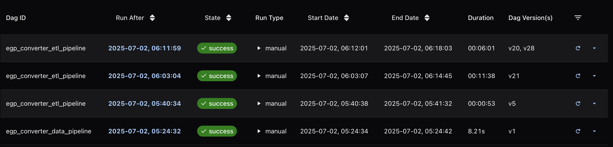

# EGP Converter ETL Data Pipeline

This project uses Apache Airflow to automate an ETL (Extract, Transform, Load) process for historical EGP (Egyptian Pound) exchange rates.

## Overview

The DAG `egp_converter_etl_pipeline` does the following:

- **Extract**: Gets currency data for the year 2013 from an external API.
- **Transform**: Cleans and converts the data into a table using Pandas.
- **Load**: Saves the final data into a CSV file in the `data/` folder.

## DAG Tasks

1. `extract_latest_data` – Fetches raw data from the API.
2. `transform_data` – Parses the data and keeps only useful parts.
3. `load_data_to_csv` – Saves the final data into a CSV file.

The tasks run in this order:

## Example Screenshots

- DAG graph view in Airflow:
  
  

- Successful DAG runs:

  
  
