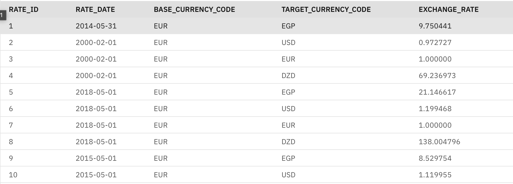

# Currency Exchange Rate ETL & Conversion Toolkit

> Comprehensive Python toolkit for fetching, storing, and converting currency exchange rates using [exchangeratesapi](https://exchangeratesapi.io) and simulated IBM DB2 storage.

---

##  Index

  1. [About The Project](#about-the-project)
  2. [Key Features](#key-features)
  3. [Built With](#built-with)
  4. [Getting Started](#getting-started)
  - [Prerequisites](#prerequisites)
  - [Installation](#installation)
  - [API Key Setup](#api-key-setup)
  - [DB2 Certificate & Credentials](#db2-certificate--credentials)
  5. [Project Architecture](#project-architecture)
  - [Database Schema](#database-schema)
    - [API Endpoints](#api-endpoints)
  6. [Roadmap & Ideas](#roadmap-ideas)


---

## 📌 About The Project

This project provides an extensible framework for:
- Extracting, transforming, and loading (ETL) currency exchange rates using exchangeratesapi.io.
- Persisting data to an IBM DB2 backend.
- Performing currency conversions using both live and historical rates.

It serves as both a local ETL execution toolkit and a backend API service. The backend, built with FastAPI, exposes endpoints to run ETL processes on demand, fetch historical exchange data, and perform currency conversions programmatically via HTTP APIs.

### Supported Features:
- Automated data collection (daily, monthly, annual)
- Historical queries by date or currency pair
- Currency conversion between supported currencies (EUR, USD, EGP, DZD)

---

##  Key Features

| Feature         | Description                                                                                 |
|-----------------|--------------------------------------------------------------------------------------------|
|  Real-time Rates  | Fetch latest currency exchange rates from https://exchangeratesapi.io API                             |
|  Historical Rates | Retrieve and store rates for specific days, months, or years                            |
|  Currency Conversion | Convert between supported currencies using live or historical data                 |
|  Simulated DB2 ETL | Store exchange rates for USD, EUR, EGP, DZD in a structured database schema            |
|  Flexible Queries  | Support for daily, monthly, and annual                            |

---

##  Built With

- **Python** 3.x
- `requests`
- `pandas`
- `time`
- `ibm_db`
- `fastapi`
- `uvicorn`
- `gunicorn`

- This project requires the following Python packages, as specified in `requirements.txt`

---

##  Getting Started

### Prerequisites

1. **API Key** 
   - Register at [exchangeratesapi](https://exchangeratesapi.io) and obtain your personal API key.

2. **IBM DB2 Credentials** (don't forget the ssl certificate)
   - Ensure DB2 instance access, or set up with provided simulation.

3. **Python Packages**
   - Install required packages:

```bash
pip3 install requests ibm_db
```

---

### Installation

1. **Clone the repository**

```bash
git clone git@github.com:AhmadNader319/EGP-Converter.git
cd EGP-Converter
```

2. **Install dependencies**

```bash
pip install -r requirements.txt
```

---

### API Key Setup

- Place your API key in an environment variable, configuration file, or directly in the script (discouraged for production).

```python
API_KEY = "YOUR_ExchangeRates_API_KEY"
```

---

### DB2 Certificate & Credentials

For secure DB2 connection, ensure you have:
- Database name 
- Hostname
- Port
- Username & password (user credentials)
- SSL certificate (if required)

These details should be configured in your application's connection logic.

---
##  Project Architecture

### Database Schema

The database schema is designed to efficiently store daily exchange rates for selected currencies:

```
ERD (ER Diagram)
    CURRENCY_RATES {
        RATE_ID: int
        RATE_DATE: date
        BASE_CURRENCY_CODE: str
        TARGET_CURRENCY_CODE: str
        EXCHANGE_RATE: Decimal
    }
```

| Column     | Type           |
|------------|----------------|
| RATE_ID       | `Integer`    |
| RATE_DATE       | `Date`   |
| BASE_CURRENCY_CODE   | `varchar(3)` |
| TARGET_CURRENCY_CODE   | `varchar(3)` |
| EXCHANGE_RATE   | `numeric(18,6)` |

---


### API Endpoints

| Purpose          | Endpoint Example                                                                                   |
|------------------|--------------------------------------------------------------------------------------------------|
| Latest Rates     | `https://api.exchangeratesapi.io/v1/latest?access_key=API_KEY`                                       |
| Historical Rates | `https://api.exchangeratesapi.io/v1/YYYY-MM-DD?access_key={API_KEY}`             |

###ETL API-Backend 
- Fetch and save new data into the DB2 database.

| Endpoint | Description | Inputs |
|----------|-------------|--------|
| `/etl/historical/month` | Fetch historical data for a specific month | `year`, `month` |
| `/etl/historical/year` | Fetch historical data for a specific year | `year` |

> Year data: fetches the first day of each month.
> Month data: fetches daily data for the month.

### Rates API
| Endpoint | Description | Inputs |
|----------|-------------|--------|
| `/rates/` | Fetch all historical rates | Optional: `base_code`, `target_code` |
| `/rates/{date}` | Fetch rates for a specific date | `date`, `target_code` |

###Currency Conversion API
| Endpoint | Description | Inputs |
|----------|-------------|--------|
| `/convert` | Convert an amount from EUR to a target currency on a given date | `amount`, `date`, `base_code`, `target_code` |

Example: Convert 100 EUR to USD on 2025-07-01.

---

##  Roadmap & Ideas

| Idea             | Description                                                                          |
|------------------|--------------------------------------------------------------------------------------|
| **Current Rates**| Fetch and store the latest exchange rates daily                                      |
| **Hist1**        | Store rates from the last 10 days                                                    |
| **Hist2**        | Store rates for a user-specified date                                                |
| **Hist3**        | Store monthly rates from the last 12 months                                          |
| **Hist4**        | Store annual rates for the past 4 years                                              |
| **Hist5**        | Store rates for 30 consecutive days in a selected month                              |
| **Conversion**   | Convert between currencies using either latest or historical rates (user-selectable) |

---

## 📬 Contact

For suggestions, or contributions, please open an issue or submit a pull request on [GitHub](https://github.com/AhmadNader319/EGP-Converter.git).


# Currency Exchange Frontend

A modern React-based frontend for the Currency Exchange application that provides real-time and historical currency exchange rates with an intuitive user interface.

## 📋 Table of Contents
- [Features](#-features)
- [Prerequisites](#-prerequisites)
- [Installation](#-installation)
- [Configuration](#-configuration)
- [Available Scripts](#-available-scripts)
- [Project Structure](#-project-structure)
- [Environment Variables](#-environment-variables)
- [API Integration](#-api-integration)
- [Styling](#-styling)
- [Deployment](#-deployment)

## ✨ Features

- **Real-time Currency Conversion**
  - Convert between multiple currencies (USD, EUR, EGP, DZD)
  - Swap currencies with a single click
  - Responsive design for all screen sizes

- **Exchange Rate Display**
  - View current exchange rates
  - Filter by base currency
  - Sortable rate columns

- **Historical Data**
  - View historical exchange rates
  - Select specific dates or date ranges
  - Visual charts for trend analysis

## 🚀 Prerequisites

- Node.js (v14 or higher)
- npm (v6 or higher) or yarn
- Backend API server (see backend documentation)

## 🛠 Installation

1. Clone the repository:
   ```bash
   git clone <repository-url>
   cd frontend
   ```

2. Install dependencies:
   ```bash
   npm install
   # or
   yarn
   ```

3. Create a `.env` file in the frontend directory (see [Environment Variables](#-environment-variables))

4. Start the development server:
   ```bash
   npm start
   # or
   yarn start
   ```

## ⚙️ Configuration

### Environment Variables

Create a `.env` file in the frontend directory with the following variables:

```env
REACT_APP_API_URL=http://localhost:8000/api
```

Replace the URL with your backend API URL when deploying to production.

## 📜 Available Scripts

In the project directory, you can run:

- `npm start` or `yarn start`
  - Runs the app in development mode
  - Open [http://localhost:3000](http://localhost:3000) to view it in the browser

- `npm test` or `yarn test`
  - Launches the test runner in interactive watch mode

- `npm run build` or `yarn build`
  - Builds the app for production to the `build` folder
  - Correctly bundles React in production mode and optimizes the build for the best performance

- `npm run eject` or `yarn eject`
  - **Note: This is a one-way operation**
  - If you aren't satisfied with the build tool and configuration choices, you can `eject` at any time

## 📁 Project Structure

```
frontend/
├── public/                 # Static files
├── src/
│   ├── components/         # Reusable React components
│   │   ├── CurrencyConverter.js
│   │   ├── ExchangeRates.js
│   │   ├── Header.js
│   │   └── HistoricalData.js
│   │
│   ├── services/           # API and service layer
│   │   └── api.js
│   │
│   ├── styles/             # CSS styles
│   │   ├── converter.css
│   │   ├── header.css
│   │   ├── historical.css
│   │   ├── main.css
│   │   └── rates.css
│   │
│   ├── config.js           # Application configuration
│   └── index.js            # Application entry point
│
├── .env                   # Environment variables
├── .gitignore
├── package.json
└── README.md
```

## 🔌 API Integration

The frontend communicates with the backend API using Axios. The main API service is located in `src/services/api.js` and includes the following methods:

- `convertCurrency(from, to, amount)` - Convert between currencies
- `getLatestRates(base)` - Get latest exchange rates
- `getHistoricalRates(date, base)` - Get historical rates for a specific date
- `getHistoricalRatesForMonth(year, month, base)` - Get monthly historical rates
- `getHistoricalRatesForYear(year, base)` - Get yearly historical rates
- `getAvailableCurrencies()` - Get list of available currencies
- `triggerETL()` - Manually trigger ETL process
- `getETLStatus()` - Check ETL process status
- `triggerETLDateRange(startDate, endDate)` - Trigger ETL for a date range

## 🎨 Styling

The application uses custom CSS with a responsive design. The styles are organized by component in the `src/styles` directory.

### Main Styling Features:
- Responsive grid layout
- Card-based component design
- Interactive form elements
- Loading states and error messages
- Mobile-friendly navigation

## 🚀 Deployment

### Building for Production

To create a production build:

```bash
npm run build
# or
yarn build
```

This will create an optimized production build in the `build` folder.

### Serving the Production Build

You can serve the production build locally using `serve`:

```bash
npm install -g serve
serve -s build
```

### Deploying to a Static Host

You can deploy the `build` folder to any static hosting service, such as:
- [Netlify](https://www.netlify.com/)
- [Vercel](https://vercel.com/)
- [GitHub Pages](https://pages.github.com/)

## 🤝 Contributing

1. Fork the repository
2. Create your feature branch (`git checkout -b feature/AmazingFeature`)
3. Commit your changes (`git commit -m 'Add some AmazingFeature'`)
4. Push to the branch (`git push origin feature/AmazingFeature`)
5. Open a Pull Request

## 📄 License

This project is licensed under the MIT License - see the [LICENSE](LICENSE) file for details.

## 🙏 Acknowledgments

- [React](https://reactjs.org/)
- [Axios](https://github.com/axios/axios)
- [date-fns](https://date-fns.org/)
- [Bootstrap](https://getbootstrap.com/) (for responsive grid)


## 📬 Contact

For suggestions, feedback, or contributions, please visit the project repository:
[EGP-Converter-FrontEnd on GitHub](https://github.com/KhaledMeow/EGP-Converter-Feat-FrontEnd)

Or contact the maintainer: [KhaledMeow](https://github.com/KhaledMeow)
